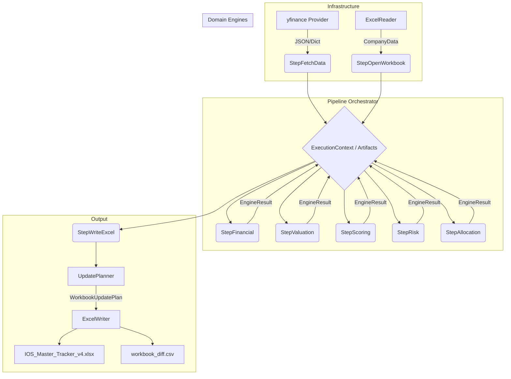

# System Design (v4.0)

## Component Diagram

## State Management

State is entirely managed by the `ExecutionContext` passing through `PipelineStep`s.
- **`config`**: Loaded once, immutable during execution.
- **`artifacts`**: The "working memory". Successive steps populate data here. E.g. `raw_companies` -> `market_data` -> `financials` -> `business_scores`.
- **`state`**: Tracked via an Enum (`INITIALIZED`, `RUNNING`, `COMPLETED`, `FAILED`).

## Safety Mechanisms

1. **System Zones**: Hardcoded boundary dictating which columns IOS is permitted to modify, enforced by `UpdatePlanner`.
2. **Dry Run**: Executing with `--dry-run` copies the workbook to `*_DRYRUN.xlsx` before execution, ensuring the original is never touched.
3. **Post-save Validation**: `ExcelWriter` executes a load test on the output workbook to guarantee no corruption occurred during save.
